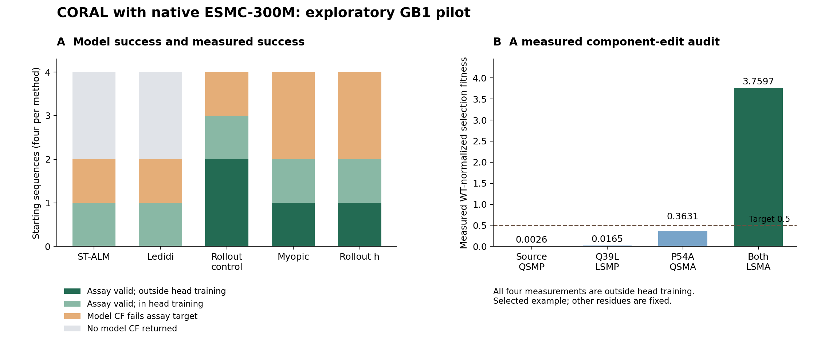

# CORAL with ESMC and ENCODE BPNet

The engine now searches against an actual frozen ESMC-300M transformer with a
GB1 functional readout, and against a released ENCODE FOXA1 BPNet model. ALM,
discrete acceptance, straight-through gradients and temperature annealing are
retained. There is no explicit edit-count cap. The completed CPU pilot does
**not** establish an advantage from h guidance: the rollout control finds more
assay-valid GB1 endpoints. The strongest result is the audit's separation of
search regret, predictor error and measured component interactions.



**What was executed.** Four GB1 starting sequences, one seed each, five methods,
and a ceiling of 256 search forward-sequence evaluations per run. A second
experiment uses one verified out-of-fold 2,114bp hg38 window, two seeds and
1,024 evaluations. These are engineering and hypothesis-generating experiments.
They are not a GPU scaling study or a statistically powered optimizer ranking.

The corrected comparison is in
[gb1_esmc300m_comparison](../research_results/gb1_esmc300m_comparison), with
[aggregate results](../research_results/biological_summary.json). The original
`gb1_esmc300m_cf` results remain available. A proposal correction was made after
inspecting the initial experiments; the same four origins were reused. The
unchanged ST-ALM and Ledidi records were retained, and all three sampling methods
were rerun. File hashes and this amendment are recorded in `provenance.json`.

**Predictor and data.** The primary model is native
[Biohub ESMC-300M](https://huggingface.co/biohub/ESMC-300M), weight revision
`a59b831785f907e96e6a246b1d142bfb76df31ee`, using
[Biohub's implementation](https://github.com/Biohub/esm/tree/bf343ba264b650dff7a073643725f9aaa1fdbe8d).
Its weights are frozen. A ridge readout uses the mean embedding and the four
experimental site embeddings. Gradients pass through the whole transformer to
probability-weighted amino-acid embeddings; this is not a cached embedding
lookup or a gradient-boosted surrogate during search. Native-token parity is
zero in the tested cases, and a probability-simplex directional derivative
agrees with finite differences to 2.2e-9 absolute error.

The assay is the four-site GB1 landscape from
[Wu et al., 2016](https://elifesciences.org/articles/16965), obtained from a
[pinned SaProtHub mirror](https://huggingface.co/datasets/SaProtHub/Dataset-GB1-fitness/tree/29bd1ffac5427d9fe8862f48f1f24b9fa18dff8c).
The loader checks its SHA-256, 149,361 unique 56-residue sequences, and variation
only at positions 39, 40, 41 and 54. The 10,639 missing states remain unknown.
The score is WT-normalized selection fitness involving folding and IgG-Fc
binding, not an isolated binding constant. No prospective assay was performed.

The readout trains on 2,168 measured zero-to-double mutants and 4,096 triples.
Validation uses 512 disjoint triples; testing uses 512 quadruples. Stable hashes
define the ordering. Hyperparameters are selected by validation RMSE. This is a
mutation-order holdout within one protein, not a held-out protein-family study;
exposure during language-model pretraining is not established.

| Readout on the same training split | Quadruple-test R² | Test RMSE, log1p fitness | Test Spearman |
|---|---:|---:|---:|
| Frozen ESMC features + ridge | 0.121 | 0.1525 | 0.327 |
| Additive residue one-hot + ridge | -0.251 | 0.1819 | 0.434 |

ESMC improves squared-error prediction but has worse rank correlation than the
additive baseline. Validation R² is 0.672, substantially above test performance.
These results do not establish that the model reliably captures GB1's
combinatorial landscape. Earlier ESM-2 35M runs are preserved as preliminary
references, not the primary model requested by the user.

**Optimizer definition.** For each frozen outer ALM episode k, the current
implementation uses the PHR inequality energy

\[
E_k(x)=d_H(x,x_0)+\sum_j\frac{[\lambda_j+\rho g_j(x)]_+^2}{2\rho},
\qquad G_k(x)=\exp[-E_k(x)/\epsilon].
\]

The omitted PHR subtraction is constant in x within the episode. The ideal
message is \(h_t(x)=\mathbb E_K[G_k(X_T)\mid X_t=x]\). The reference K allows
reversions. GB1 uses a lazy single-coordinate kernel with horizon four, which
can reach every state in its four-site domain. ENCODE uses independent per-site
changes with expected 0.5 substitutions per step and horizon eight; it has
positive support for any subset of edits even in one step. Small expected
mutation counts are an inductive bias, not an endpoint edit cap.

Eight whole-sequence particles draw three candidates each. The rollout guide
uses two cheap reference continuations to the remaining horizon, then queries
the functional model at their leaves. Myopic guidance scores the immediate
candidate. The rollout control makes the same kind of leaf queries and archives
them, but discards intermediate guide values. It still uses the terminal ALM
potential and ALM outer updates. It is therefore a control for the value of
lookahead guidance, not plain uniform random search.

The corrected defensive proposal for candidate j is

\[
r_j=(1-\eta)\operatorname{softmax}(\log\psi)_j+\eta/M,
\quad \eta=0.02,
\]

with importance increment
\(\log\psi_j-\log M-\log r_j-\log\psi_{\rm previous}\).
The selected *realized* stochastic message is carried into the next denominator.
An absolute floor on exp(-energy), used initially, can erase guidance when ALM
penalties grow. Mixing normalized proposals avoids that scale dependence.
Tests check the importance identity, invariance under a -1e6 log-message shift,
and a multistep stochastic-guide normalizer. A finite particle approximation
does not become an exact target sample merely because it has importance weights.

Multipliers are frozen within episodes and updated from the weighted terminal
constraint residual between episodes; rho increases when violation persists.
This finite ALM procedure does not guarantee pointwise feasibility. Every
returned endpoint must separately satisfy every constraint after explicit
discrete evaluation. All methods archive all hard candidates they query,
including rollout leaves, using minimum edits followed by feasibility margin.
Exhausting a compute allowance is reported as search failure, never a proof of
infeasibility. Mechanism blocking is deliberately deferred.

**GB1 comparison.** The target is measured-fitness scale 0.5, represented as a
log1p threshold for the model. Origins are the first hash-ordered test sequences
whose model prediction is below target; assay values do not select origins or
proposals. The actual upstream Ledidi implementation is pinned to
`beeee38f81bc00f902d41cc02695cec485b41cb9`; its hinge-loss weight was chosen from
0.01, 0.1 and 1 using two distinct validation origins. Weight 1 was selected.
This small tuning set is a limitation. ST-ALM is the generic sequence version
of CORAL's mean-reduced PHR objective with hard Gumbel samples and cosine tau
annealing, rather than an exact reproduction of the legacy seqgra runner.

| Method | Model CFs / 4 | Assay-valid / 4 | Assay-valid outside head training / 4 | Mean model regret, successful runs |
|---|---:|---:|---:|---:|
| ST-ALM | 2 | 1 | 0 | 0.5 |
| Upstream Ledidi + hinge | 2 | 1 | 0 | 0 |
| Rollout control | 4 | 3 | 2 | 0 |
| Myopic ALM guide | 4 | 2 | 1 | 0 |
| Rollout h + ALM | 4 | 2 | 1 | 0 |

All 16 returned endpoints have measured assay values. Failed runs are not
assigned zero regret. The rollout guide's assay edit regret, conditional on
assay success, averages 0.5; the control averages 0.333. Comparing those means
alone would conceal their different success rates.

The CPU search averaged 18.8 seconds for rollout h, 19.2 for its control, 22.6
for myopic guidance, and approximately 46 seconds for each gradient method.
The gradient methods each used about 248 backward-sequence evaluations in
addition to approximately 250 forwards. A batch of eight permits only about
31 gradient updates at this ceiling; larger budgets, smaller batches and
convergence tuning are required before drawing a baseline ranking. These times
exclude final acceptance checks and come from a shared CPU environment. They
do not establish equal-FLOP efficiency or GPU throughput.
At this ceiling ST-ALM completed one multiplier update per run, while the
rollout methods completed two episodes; the outer solve was also short.

Search used BF16 autocast with FP32 weights. A common final FP32 gate checks the
source plus up to 16 model-feasible cached endpoints per run before reporting
success; those extra forwards are counted separately. All component audits use
FP32. Feature extraction for the shared readout cost 7,288 sequence forwards
and about 555 CPU seconds; it is separate from per-search timings.

**The edit-regret diagnosis.** A post-search audit evaluated the source and all
76 possible single substitutions for each origin, plus every component subset
of returned edit sets: 315 unique additional FP32 queries, about 56 seconds.
This certifies the minimum model edit count in these four cases without
enumerating the entire language-model landscape.

| GB1 source row | Certified model minimum | Minimum among measured assay variants | Measured single substitutions / 76 |
|---|---:|---:|---:|
| 115108 | 2 | 1 | 75 |
| 37973 | 1 | 1 | 76 |
| 98204 | 1 | 2 | 73 |
| 60900 | 2 | 2 | 75 |

For row 115108, a two-edit CF is optimal for the predictor even though a measured
one-edit biological solution exists. Better optimization of this same predictor
cannot remove that discrepancy. For row 98204, the guide's optimal one-edit
model CF has measured fitness 0.3969 and fails the 0.5 target. Missing assay
neighbors prevent equating the measured minimum with an exhaustive biological
minimum where they matter. Model regret and measured-assay regret must remain
separate endpoints.

**A compositional explanation supported by measurements.** In background QSMP
at sites (39,40,41,54), rollout h returns Q39L plus P54A. Their component audit is:

| Intervention | Measured selection fitness | Reaches 0.5? |
|---|---:|---|
| Source QSMP | 0.002642 | No |
| Q39L only, LSMP | 0.016516 | No |
| P54A only, QSMA | 0.363094 | No |
| Both, LSMA | 3.759711 | Yes |

All four labels were excluded from head training. The raw-fitness interaction
contrast \(f_{11}-f_{10}-f_{01}+f_{00}\) is +3.3827; the log1p contrast is +1.2367.
The predictor also has a positive log1p contrast (+0.2681). This is an observed
background-specific non-additive response, beyond simply drawing an AND-shaped
threshold. It is a selected example with no replicate-derived uncertainty
interval here, not evidence of a universal rule or a structural mechanism.
Both edits are necessary within this pair, while a different measured one-edit
solution exists elsewhere. That distinction is useful for a future rule
primitive: intervention set, background, component responses, non-additivity,
counterexamples, and the domain over which minimality was checked.

**ENCODE transfer.** The model is
[FOXA1 ChIP-seq in genetically modified HepG2](https://huggingface.co/kundajelab/encode-bpnet-FOXA1-ChIP-seq-HepG2-ENCSR865RXA-ENCSR337KST),
revision `adde8fa27ceb7647e35aebe456620ea6b40d4ec3`, fold 0. The window is hg38
chr1:1005512-1007626, centered on an IDR peak in
[ENCFF081USG](https://www.encodeproject.org/files/ENCFF081USG/).
The downloaded [ENCFF277YRG split archive](https://www.encodeproject.org/files/ENCFF277YRG/)
confirms chr1 is a test chromosome and this exact summit belongs to its test
peaks. There are no overlapping training or validation peak/nonpeak regions.
The earlier download blockage is resolved; the old smoke manifest is retained
as a historical record, and new runs contain verified split manifests.

The BPNet adapter fixes an upstream conversion error: the profile-head bias
must pass through the final 1x1 mixer before adding its bias. Against the native
TensorFlow export, corrected maximum errors are 4.1e-6 for profile logits and
2.4e-7 for logcounts; eight input-gradient directions agree with TensorFlow
finite differences to 1.2e-4. Controls remain fixed at native zero profile and
zero log-count inputs, whose count aggregation is logsumexp(0,0)=log(2).

The editable region is 128bp centered on the summit. At a twofold predicted
count-decrease target, all five methods fail both seeds within 1,024 forwards.
That remains unresolved search difficulty, not certified infeasibility.
For the feasible control, an exhaustive 384 single-substitution screen finds a
best logcount of 0.6810 from a source of 0.8649. The threshold halfway between
them is 0.7729, about an 8.8% count reduction; 21 single edits satisfy it.
Only that scalar threshold is supplied to fresh search oracles. Calibration
costs 384 extra forwards and is disclosed separately.

| Method | Feasible control successes / 2 | Returned edit counts | Mean model regret |
|---|---:|---|---:|
| ST-ALM | 2 | 1, 1 | 0 |
| Ledidi + hinge | 2 | 1, 1 | 0 |
| Rollout control | 2 | 2, 1 | 0.5 |
| Myopic ALM guide | 2 | 1, 1 | 0 |
| Rollout h + ALM | 2 | 1, 1 | 0 |

This verifies end-to-end genomic editing and identifies one avoidable extra
edit in the control. It does not demonstrate an h advantage on difficult
genomic targets. BPNet is a sequence-to-function CNN, not a biological language
model. Reference ChIP-seq validates the source peak, not the mutant occupancy;
the generated genomic sequences are computational hypotheses only.

**The next optimizer experiment.** Retain ALM and the discrete acceptance gate.
The immediate research bottleneck is demonstrating that a guide contains
useful future-feasibility information beyond the leaf evaluations themselves.
The current two-rollout estimate has not done so on GB1. A useful next candidate
is a small joint-state critic for relative log h, conditioned on remaining
horizon, target, source and ALM multipliers/rho. Distill its proposal preferences
from model-generated rollouts on separate training origins, then freeze it for
evaluation. This could shift categorical mass cheaply while keeping full-model
queries for endpoint evaluation. It is proposed work, not an implemented or
validated improvement. Training only independent per-site scores would discard
the combinatorial context the project wants to recover.

| Next question | Controlled experiment | Advancement criterion |
|---|---|---|
| Does future guidance help? | Control, myopic, R=2/8/32 rollouts and a distilled joint h, with identical ALM/reference/archive | Better success-regret frontier on new origins after charging guide training and teacher queries |
| Are gradients under-converged? | ST/Ledidi batch sizes 1/2/8, learning rates and tau schedules tuned on validation origins; 256/1024/4096 forward ceilings | Compare convergence and actual forward/backward time, including acceptance checks |
| Is the target landscape learned? | Frozen pretrained ESMC versus additive and pairwise residue readouts; then a frozen random-encoder control | Improvement on withheld combination responses and interaction contrasts, not only endpoint scores |
| Does uncertainty reduce exploitation? | Independently trained functional heads, fixed scale/tolerances, robust joint constraints | Better withheld assay success at matched work; model agreement remains a robustness screen |
| Does the reference geometry matter? | Uniform reversible mutations versus a protein-prior proposal with correct probability accounting | Reduced model and assay regret without losing alternative feasible combinations; charge prior calls |
| Does it scale in genomics? | At least 100 eligible windows from released test chromosomes, multiple targets and 5 seeds, batched CUDA inference | Wall-time and memory curves, success coverage and edit regret bounds; separate profile and count tasks |

Freeze that protocol before selecting new outcomes. For GB1, retain measured
source, endpoint and component interventions and report training membership and
missing labels. For ENCODE, select a matched perturbation assay or perform
prospective measurements before claiming biological validity of new mutants.
Later two-model optimization can use a vector of ALM constraints, but this pilot
does not execute a biological two-model task. The existing joint-constraint
tests only validate software behavior.

[Cherimoya](https://github.com/jmschrei/cherimoya) is a worthwhile separate
genomic predictor/acceleration experiment. Its released architecture and
checkpoints are distinct from this BPNet checkpoint. Its fastest inference
megakernel is selected under no_grad; gradient-based editing needs its
differentiable execution path. Benchmark both paths and verify final margins
against an agreed precision before interpreting their speed difference.
Neither Cherimoya nor GGUF inference was run here. Native ESMC was used because
it supplies the autograd path needed for a fair gradient comparator; an API or
quantized embedding service alone does not supply that path. Managed Biohub
and NVIDIA credentials were unavailable in this runtime, so no paid deployment
was launched. Public native weights enabled the completed experiments.

**Reproduction.** Python 3.12 and Torch 2.11.0+cpu were used. Install Torch for
the intended hardware, followed by the minimal inference dependencies and the
pinned packages. The complete ESM extras include unrelated GPU folding tools.

```bash
python -m pip install -r requirements-biological.txt
python -m pip install --no-deps \
  'esm @ git+https://github.com/Biohub/esm.git@bf343ba264b650dff7a073643725f9aaa1fdbe8d' \
  'ledidi @ git+https://github.com/jmschrei/ledidi.git@beeee38f81bc00f902d41cc02695cec485b41cb9' \
  'bpnet-lite @ git+https://github.com/jmschrei/bpnet-lite.git@b37e766bd7a2bef1614cf18d8bac38167e6f6ff5'
python -m unittest discover -s tests -v
python -m coral.runners.download_biological_assets --directory research_data/biological --esmc --bpnet

# Reuse the saved, validated head; no feature refitting is necessary.
python -m coral.runners.run_gb1_esm \
  --data research_data/biological/gb1.csv \
  --checkpoint research_data/biological/esmc300m \
  --head-dir research_results/gb1_esmc300m \
  --output research_results/gb1_reproduction \
  --cases 4 --seeds 1 --budget 256 --target-fitness .5 --threads 4
python -m coral.runners.audit_gb1_cf \
  --data research_data/biological/gb1.csv \
  --checkpoint research_data/biological/esmc300m \
  --head-dir research_results/gb1_esmc300m \
  --runs-dir research_results/gb1_reproduction --threads 4
```

To refit the head, use `fit_gb1_esm` with `--family esmc --train-triples 4096
--validation-size 512 --test-size 512 --amp-bf16`, a new output directory and an
explicit feature-cache path. Runtime precision and cache hashes are checked.
The saved `model_validation.json` contains the full selection and provenance.

```bash
python - <<'PY'
import json
from pathlib import Path
saved = json.loads(Path('research_results/encode_foxa1/window_protocol.json').read_text())
window = dict(saved['window'], dna=saved['source'])
Path('research_data/biological/window.json').write_text(json.dumps(window))
PY
python -m coral.runners.run_bpnet_cf \
  --checkpoint research_data/biological/foxa1_bpnet/fold_0/model.h5 \
  --window-json research_data/biological/window.json \
  --split-archive research_data/biological/ENCFF277YRG.tar.gz \
  --task single-edit-control --output research_results/encode_control_reproduction \
  --budget 1024 --threads 2
# Repeat with --task twofold and a different output directory.
python -m coral.runners.summarize_biological
```

The last command regenerates this report's figure and aggregate JSON from the
committed experiment directories without model calls. The TensorFlow parity
reference can be regenerated separately with `bpnet_tf_reference.py` and
TensorFlow CPU 2.20, then checked with `coral.models.bpnet.verify_against_tf`.
Unit tests cover importance corrections, stochastic-message carry-over,
reference reversions/support, immutable positions, hard-only acceptance,
joint constraints, upstream Ledidi integration and ENCODE split leakage.
